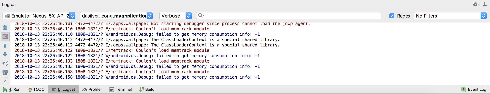

## Danny-Android

### 07. Log

#### 1) Log

로그에는 '기록' 이라는 뜻이 있다.

앱 실행 중 특정 시점을 기록으로 남기는 것이다.

안드로이드 스튜디오 하단의 Logcat 탭을 누르면 이렇게 많은 로그들이 찍히게 된다.

안드로이드 개발을 하면서 곳곳에 로그를 작성하며 변수 값, 클래스의 값 등을 확인하거나 예상대로 실행하는지 확인하는 디버깅의 목적으로 종종 사용하게 된다.

#### 2) Log의 종류

- Log.e("tag", "error message"); : Error의 약자, 가장 심각한 문제가 발생했을 때 남기는 로그이다. 빨간색으로 표시된다.
- Log.w("tag", "warning message"); : Warning의 약자, 심각하지는 않지만 나중에라도 문제의 소지가 있을 수 있어 경고 용으로 남기는 로그이다. 빨간색으로 표시된다.
- Log.i("tag", "information message"); : Information의 약자, 어떤 처리를 하면서 발생하는 진행 과정 등을 모니터링하기 위한 목적으로 남기는 로그이다. 주황색으로 표시된다.
- Log.d("tag", "debugging message"); : Debugging의 약자, 디버깅 목적으로 문제 발생 가능성이 있는 곳에 남기는 로그이다. 초록색으로 표시된다.
- Log.v("tag", "verbose message"); : Verbose의 약자, 별로 중요하지 않은 것을 남길 때 사용하는 로그이다. 검정색으로 표시되며 개발중에만 나타난다.

#### 3) Log사용하기

Log.[e|w|i|d|v] ("tag", "message"); 메서드를 사용한다.

첫번째 인자값엔 수 많은 로그들 중 로그를 구분 할 목적으로 사용되는 String타입의 tag를 작성하고, 두번째 인자값엔 로그를 찍을 String타입의 message를 작성하면 된다.

message는 변수의 값이 될수도, 객체의 값이 될 수도, 특정 문장이 될 수도 있다.

~~~java
public class MainActivity extends AppCompatActivity {

    @Override
    protected void onCreate(Bundle savedInstanceState) {
        super.onCreate(savedInstanceState);
        setContentView(R.layout.activity_main);

        Log.d("tag", "message");
    }
}
~~~

(MainActivity에서 디버깅용으로 로그를 남기는 예제)

"tag"라는 tag로 "message"라는 message가 찍힌 것을 확인할 수 있다.