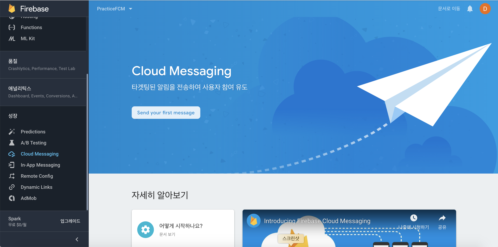
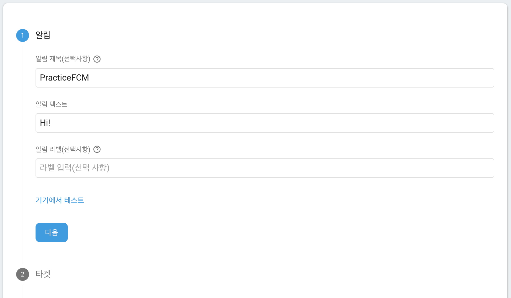
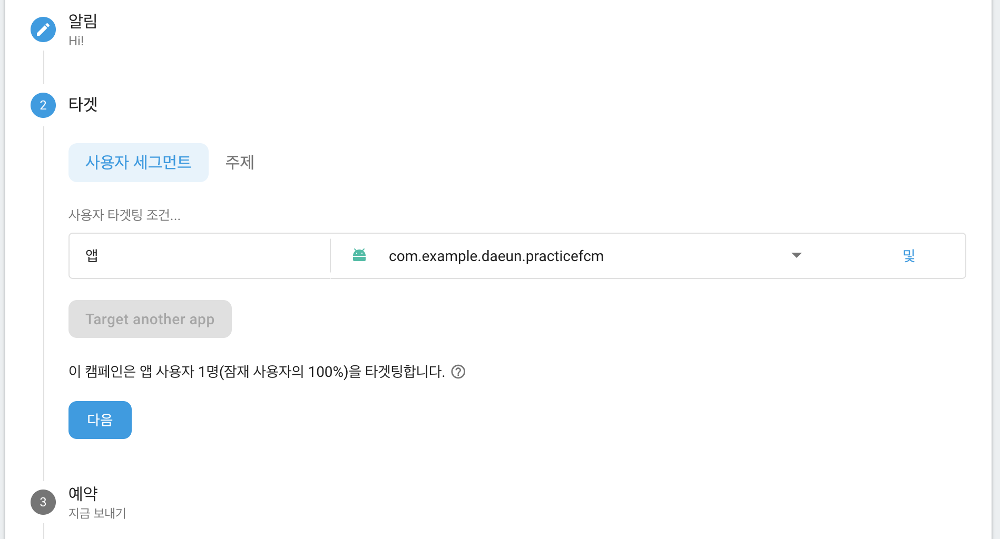
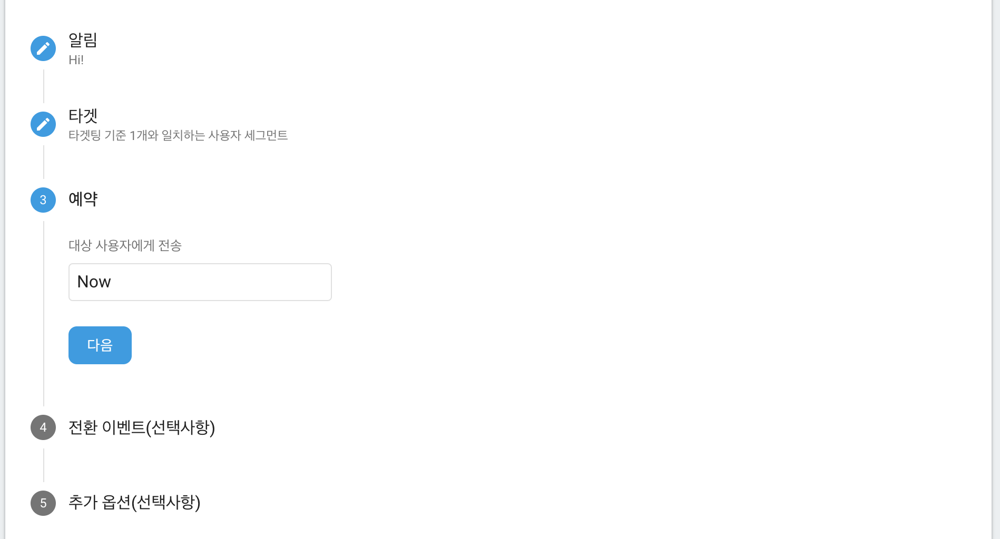
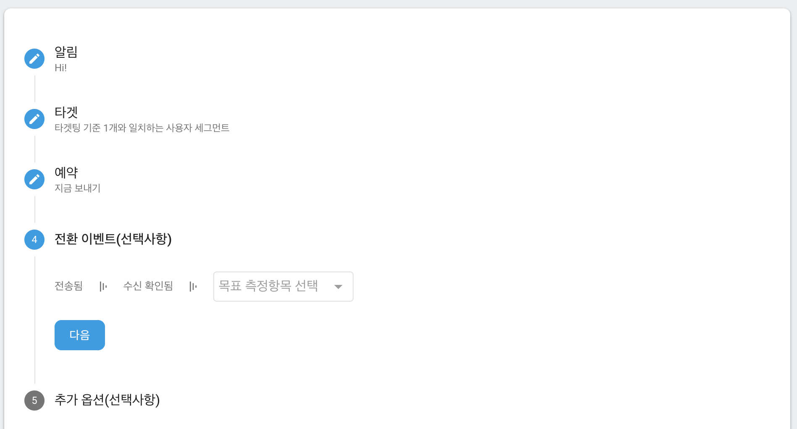
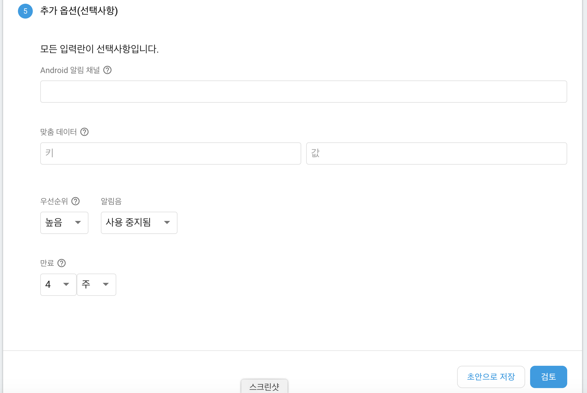
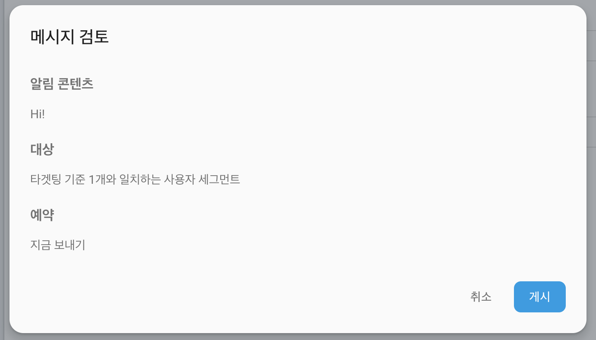
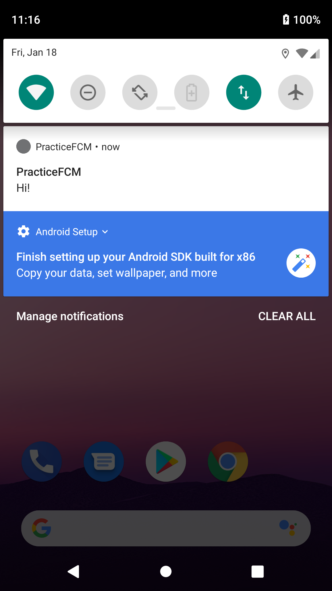

## Danny-Android

### 12. FCM

#### 1) FCM

- Firebase Cloud Messaging 의 약자
- 안드로이드의 푸시 알림을 구현할 때 사용

#### 2) FCM 사용하기

1. 안드로이드 프로젝트에 Firebase 추가

   [Firebase 공식 문서](https://firebase.google.com/docs/android/setup?hl=ko) 참조

2. 라이브러리 추가

   build.gradle(Module: app) 파일 dependencies{}에 라이브러리를 추가한다.

   ~~~kotlin
   implementation 'com.google.firebase:firebase-messaging:17.3.4'
   ~~~

3. FirebaseMessagingService 구현

   17.1.0 버전으로 업데이트되면서 FirebaseInstanceIdService는 더 이상 사용하지 않는다.

   FirebaseInstanceIdService에서 구현하던 onTokenRefresh() 메소드는 FirebaseMessagingService에서 onNewToken() 메소드를 통해 구현한다.

   ~~~kotlin
   class MyFirebaseMessagingService : FirebaseMessagingService() {
   
       private val TAG = "FirebaseService"
   
       override fun onNewToken(token: String?) {
           Log.d(TAG, "new Token: $token")
       }
   
       override fun onMessageReceived(remoteMessage: RemoteMessage) {
           Log.d(TAG, "From: " + remoteMessage.from)
   
           if(remoteMessage.notification != null) {
               Log.d(TAG, "Notification Message Body: ${remoteMessage.notification?.body}")
               sendNotification(remoteMessage.notification?.body)
           }
       }
   
       private fun sendNotification(body: String?) {
           val intent = Intent(this, MainActivity::class.java).apply {
               flags = Intent.FLAG_ACTIVITY_CLEAR_TOP
               putExtra("Notification", body)
           }
   
           var pendingIntent = PendingIntent.getActivity(this, 0, intent, PendingIntent.FLAG_ONE_SHOT)
           val notificationSound = RingtoneManager.getDefaultUri(RingtoneManager.TYPE_NOTIFICATION)
   
           var notificationBuilder = NotificationCompat.Builder(this,"Notification")
                   .setSmallIcon(R.mipmap.ic_launcher)
                   .setContentTitle("Push Notification FCM")
                   .setContentText(body)
                   .setAutoCancel(true)
                   .setSound(notificationSound)
                   .setContentIntent(pendingIntent)
   
           var notificationManager: NotificationManager = this.getSystemService(Context.NOTIFICATION_SERVICE) as NotificationManager
           notificationManager.notify(0, notificationBuilder.build())
       }
   }
   ~~~

   [MyFirebaseMessagingService.kt]

   - onNewToken()

     앱을 처음 시작할 때 FCM SDK에서 클라이언트 앱 인스턴스용 등록 토큰을 생성한다. 단일 기기를 타겟팅하거나 기기 그룹을 만들려면 onNewToken을 override하여 이 토큰에 엑세스해야한다.

     새 토큰이 생성될 때마다 onNewToken() 콜백이 호출된다.

   - onMessageReceived()

     FCM에서 푸시 메시지를 보내면 각 단말에서 자동적으로 호출되는 메소드이다.

     수신된 RemoteMessage 객체를 기준으로 작업을 수행하고 메시지 데이터를 가져올 수 있다.

     onMessageReceived가 제공된 모든 메시지는 수신된 지 20초 이내에 처리되어야 한다. 이 시간이 지나면 Android O의 백그라운드 실행 제한과 같은 여러 OS 동작으로 인해 작업을 완료하는 데 지장이 생길 수 있다

   - sendNotification()

     메시지를 넘겨받고, 그 데이터를 어떤 방식으로 폰 위에 띄울지를 설정한다.

     여기서는 RemoteMessage의 body를 넘겨받고 그 메시지를 notificationBuilder를 사용하여 메시지를 띄워준다.

     푸시 메시지를 클릭할 경우 전달될 인텐트를 설정한다.

4. AndroidManifest파일 수정

   ~~~xml
   <service android:name=".FCM.MyFirebaseMessagingService">
       <intent-filter>
           <action android:name="com.google.firebase.MESSAGING_EVENT" />
       </intent-filter>
   </service>
   ~~~

   android:name=".FCM.MyFirebaseMessagingService"에는 본인이 구현한 FirebaseMessagingService의 Path를 넣어주면 된다.

5. Firebase Console에 들어가서 메시지 보내기

   1) Send your first message 클릭

   

   

   2) 알림 텍스트 작성 (알림 제목과 알림 라벨은 선택사항)

   

   

   3) 해당 앱 클릭

   

   

   4) 다음 클릭

   

   

   5) 다음 클릭

   

   

   6) 검토 클릭

   

   

   7) 게시 클릭

   

   

   8) 끝!

   
